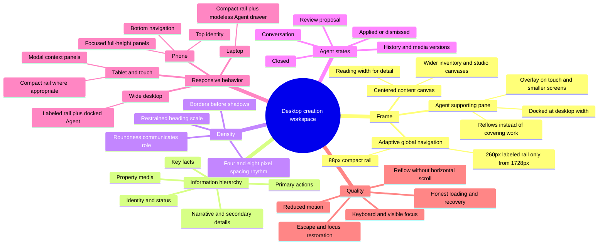

# Mature desktop workspace plan

## Outcome

Desktop Reaigen should feel like one calm creation workspace, not a dashboard made of competing
columns. Property media and the active task remain central; global navigation establishes place;
Agent is a supporting pane that can stay open while the creator reviews the result.

This plan covers the authenticated management shell, creation detail, and Agent relationship. It
preserves the established phone composition and the dark, canvas-first tour studio.

## Audit diagnosis

The previous desktop frame expanded the global navigation from 88px to 294px at 1280px. Opening
Agent then consumed another 358–400px. That left less usable creation space at a common 1280px
laptop width than at some narrower layouts, so page content wrapped early and the interface felt
like three unrelated columns.

The detail page also previously split ordinary listing information into parallel desktop columns.
That weakened the media → identity → facts → description reading order and made Agent feel like a
fourth region. The corrected model uses one centered detail manuscript and lets only genuine tools
become side panes.

## Workspace mind map

## Reference synthesis

Each external reference has one bounded responsibility:

- [Apple sidebars](https://developer.apple.com/design/human-interface-guidelines/sidebars) support
  persistent top-level navigation that can collapse when window space is constrained.
- [Apple designing for macOS](https://developer.apple.com/design/human-interface-guidelines/designing-for-macos/)
  supports taking advantage of large displays, reducing nested navigation, and keeping direct
  manipulation available.
- [Apple panels](https://developer.apple.com/design/human-interface-guidelines/panels) support Agent
  as a related-control surface that leaves the active document or creation visible.
- [Fluent 2 layout](https://fluent2.microsoft.design/layout) informs breakpoint-aware spacing,
  proximity, and a manuscript-style reading column for long-form detail.
- [Android responsive navigation](https://developer.android.com/develop/ui/views/layout/build-responsive-navigation)
  supports changing navigation form by available width instead of scaling one component
  continuously.
- [WCAG 2.2 Reflow](https://www.w3.org/WAI/WCAG22/Understanding/reflow.html) is the accessibility
  guardrail: content and functionality reflow without requiring two-dimensional scrolling.

These references inform structure, not visual imitation. Reaigen keeps its existing monochrome,
image-led design language and its own capsule/action geometry.

## Breakpoint contract

| Environment | Navigation | Agent | Content behavior |
|---|---|---|---|
| `<768px` | Mobile header and bottom navigation | Full-width focused panel | One-column, 16px gutters, 44px touch targets |
| `768–1439px` | 88px compact rail | Modeless 400px right drawer | Workspace retains its natural width and remains interactive |
| `1440–1727px` | 88px compact rail | Docked, `360–400px` | Content consumes the remaining width and reflows |
| `≥1728px` | 260px labeled rail | Docked, up to `400px` | Full workspace; centered reading columns remain bounded |

The Agent panel never creates a backdrop or body scroll lock when docked. Closing it returns the
full width to the creation. The medium-width drawer is also modeless, so the visible workspace can
still be inspected and operated. Pointer type cannot force a desktop-width workspace into the phone
composition. At no supported width may the shell introduce horizontal page scrolling.

## Development plan

### P0 — workspace frame and hierarchy

Status: implemented in the desktop polish pass.

- Keep the global rail compact through ordinary laptop and 1600px desktop widths.
- Expand labeled navigation only at 1728px and above, reducing its wide width to 260px.
- Keep Agent modeless at 768–1439px and dock it from 1440px, when both panes have usable width.
- Keep creation detail as one centered 980px manuscript rather than a two-column dashboard.
- Reduce oversized route headings and position Agent's empty invitation near the actionable area.
- Preserve the mobile account/sign-out path and full-height keyboard-aware panels.

### P1 — interaction hardening

Status: implemented in the follow-up UX caveat pass.

- Phone Agent is a true modal dialog with close-control focus, Tab containment, Escape, and focus
  restoration. Medium-width Agent remains explicitly modeless.
- Compact Agent tabs use short visible labels while retaining full accessible names in every
  supported language.
- Phone account actions support first-item focus, arrow navigation, Escape, and a reachable sign-out
  action.
- Stale-data refresh actions identify the data they refresh; detail, sharing, and tour exits resolve
  to a stable in-product parent instead of depending on browser history.
- Target widths from 320px through 1728px were checked for horizontal overflow and composition.

### P2 — route-level density alignment

- Apply the same title scale and section rhythm to Creations, Tours, Shares, and Settings.
- Keep inventory routes wider than reading routes, with at most one contextual filter rail.
- Remove duplicate summaries and cards that repeat status already visible in filters or media.
- Keep media manager preview-first on desktop and action-dock-first on phones.

### P3 — authenticated product QA

- Validate real creator data and permissions against Django.
- Confirm Agent proposals, media actions, and history remain visible after apply/dismiss.
- Test creation detail, share composer, version manager, and tour launch at target widths.
- Record visual regression fixtures for closed and open Agent states.

## Acceptance criteria

- At 1024px and 1280px, Agent opens as a modeless right drawer without resizing the creation canvas.
- At 1440px, opening Agent docks it beside a usable creation canvas with no backdrop.
- At 1728px and above, the labeled rail and Agent coexist without hiding core actions.
- Creation detail retains one clear media-to-description reading order.
- Phone-width devices retain the established focused-panel behavior.
- Keyboard focus, Escape, and focus restoration behave according to panel modality.
- No route gains horizontal page scrolling at 200% zoom or target viewport widths.
- The shell communicates one active workspace rather than independent dashboard columns.

## Guardrails

- Do not restore the two-column creation-detail layout.
- Do not expand the labeled navigation below 1728px merely because space exists while Agent is closed.
- Do not turn Agent into a floating chat bubble or let a docked panel obscure the active creation.
- Do not use desktop polish as a reason to shrink mobile controls or remove safe-area handling.
- Do not add decorative analytics, gradients, or extra cards to manufacture desktop density.
